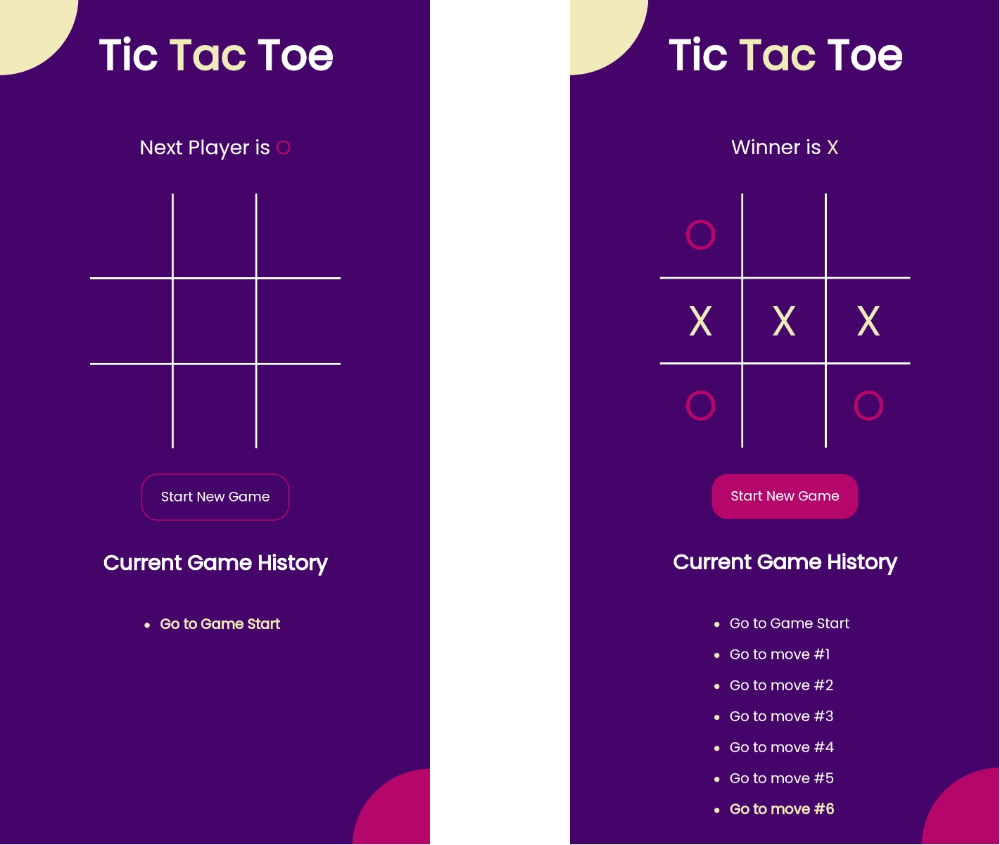

# Tic Tac Toe-Vite

This is a TicTacToe game project created using React and Vite. The game is deployed and accessible at [https://keraskp.github.io/tictactoe-vite/](https://keraskp.github.io/tictactoe-vite/).

## Features

- Play TicTacToe
- Choose your preferred symbol (X or O) before starting the game.
- The game keeps track of the moves, displaying the move state.
- Override moves by clicking on the desired moves.
- Reset the game at any time to start over.

## Installation

To run the project locally, follow these steps:

1. Clone the repository: `git clone https://github.com/keraskp/tictactoe-vite.git`
2. Navigate to the project directory: `cd tictactoe-vite`
3. Install the dependencies: `npm install`
4. Start the development server: `npm run dev`
5. Open your browser and visit [http://localhost:5173/tictactoe-vite/](http://localhost:)

## Usage

- Choose your preferred symbol (X or O) by clicking on the respective button.
- Click on any empty cell to make your move.
- The computer opponent will automatically make its move.
- The game will display the result (win, loss, or draw) and update the score accordingly.
- To start a new game, click on the "Reset" button.

## Technologies Used

- [React](https://reactjs.org/)
- [Vite](https://vitejs.dev/)

## Credits

This project was created by [keraskp](https://github.com/keraskp).
